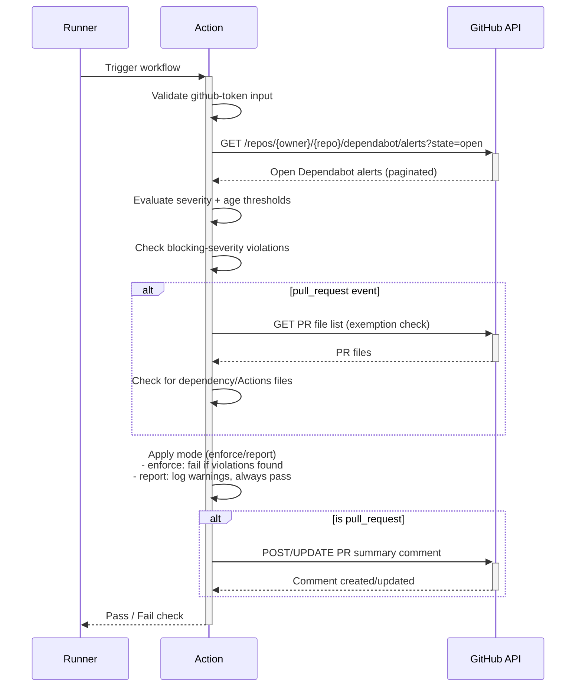

# Dependabot Policy Enforcer Action

<!-- vale off -->
[](https://github.com/nhs-england-tools/dependabot-policy-enforcer-action/actions/workflows/cicd-1-pull-request.yaml)
[](https://sonarcloud.io/summary/new_code?id=dependabot-policy-enforcer-action)
<!-- vale on -->

A reusable GitHub Action that runs as a required workflow check. It calls the GitHub Dependabot Alerts API using the workflow token, evaluates alert age against policy thresholds, and validates that a repository meets Dependabot policy requirements.

This action:

1. Reads the workflow token from the `github-token` input
2. Fetches open Dependabot alerts from the GitHub API
3. Evaluates the age of alerts against severity-based policy thresholds
4. Evaluates the old alerts against the minimum severity level (`blocking-severity`) currently being enforced
5. Fails the check with a clear message when policy thresholds are exceeded in `enforce` mode or reports the findings in `report` mode

## Table of Contents

- [Dependabot Policy Enforcer Action](#dependabot-policy-enforcer-action)
  - [Table of Contents](#table-of-contents)
  - [Setup](#setup)
    - [Prerequisites](#prerequisites)
    - [Configuration](#configuration)
  - [Usage](#usage)
    - [Inputs](#inputs)
    - [Modes](#modes)
    - [PR comments](#pr-comments)
    - [Dependency update exemption](#dependency-update-exemption)
    - [Testing](#testing)
  - [Design](#design)
    - [Diagrams](#diagrams)
    - [Modularity](#modularity)
  - [Troubleshooting](#troubleshooting)
  - [Contributing](#contributing)
  - [Contacts](#contacts)
  - [Licence](#licence)

## Setup

Clone the repository

```shell
git clone https://github.com/nhs-england-tools/dependabot-policy-enforcer-action.git
cd nhs-england-tools/dependabot-policy-enforcer-action
```

### Prerequisites

The following software packages, or their equivalents, are expected to be installed and configured:

- [Node.js](https://nodejs.org/) 24 or later,
- [Yarn](https://yarnpkg.com/) 4.x — enable via `corepack enable`.

### Configuration

Install dependencies

```shell
yarn install
```

Ensure the workflow has permission to read Dependabot alerts.

Recommended permissions:

| Permission | Access | Why |
| ---------- | ------ | --- |
| `vulnerability-alerts` | `read` | Required to list Dependabot alerts |
| `pull-requests` | `write` | Required to post PR comments |

## Usage

Add the following workflow file to your repository at `.github/workflows/dependabot-policy-check.yaml`:

```yaml
name: Dependabot Policy Check

on:
  push:
    branches: [main]
  pull_request:

permissions:
  vulnerability-alerts: read
  pull-requests: write

jobs:
  dependabot-policy:
    runs-on: ubuntu-latest
    steps:
      - uses: nhs-england-tools/dependabot-policy-enforcer-action@17049e7907cf426f2f7dfb874608589ba81ba9c9 # v2.2.0
        with:
          mode: ${{ vars.DEPENDABOT_ENFORCER_MODE }}
          github-token: ${{ secrets.GITHUB_TOKEN }}
          blocking-severity: critical
```

The `github-token` input is required. The action uses it to fetch Dependabot alerts from the GitHub API. The `pull-requests: write` permission is only required for PR comments.

### Inputs

| Input | Required | Default | Description |
| ----- | -------- | ------- | ----------- |
| `mode` | No | `enforce` | Policy mode: `enforce` (fail workflow on policy violation) or `report` (log warnings but do not fail). |
| `blocking-severity` | No | `critical` | Once an alert is older than the configured threshold, blocking-severity defines the minimum severity at which that alert is classified as a violation. Allowed values: `critical`, `high`, `medium`, `low`. In enforce mode, these violations can fail the workflow. In report mode, they are still reported as violations but do not fail the workflow.|
| `github-token` | Yes | — | GitHub token used to fetch Dependabot alerts and post a policy summary comment on pull requests. Use `secrets.GITHUB_TOKEN`. Requires `vulnerability-alerts: read` permission. |

### Modes

The `mode` input controls how the action responds to policy violations:

| Mode | Behaviour |
| ---- | --------- |
| `enforce` | Fails the workflow check when the repository does not meet the Dependabot policy. This is the default. |
| `report` | Logs the policy result as a warning but always passes the workflow check. Use this during initial roll-out to observe results without blocking merges. |

Set the mode centrally via an organisation variable (`DEPENDABOT_ENFORCER_MODE`) so that all repositories share the same default. Individual repositories can override it with a repository-level variable of the same name.

### PR comments

When the workflow is triggered by a `pull_request` event, the action posts a summary comment on the PR.

The comment includes:

- **Status** — ✅ Passed, ❌ Failed, or ⚠️ Exempted
- **Mode** — the active mode for this run
- **Severity** — the `blocking-severity` used for this run.
- **Summary** — severity counts from the policy check
- **Violations** — findings per category with link to alert. If nothing is shown, then no violating alerts were found.
- **Alerts needing attention** - Details alerts that were found to be older than the current age thresholds but have a severity below the configured `blocking-severity`
- **Link** — direct link to the repository's Dependabot alerts page

The comment is idempotent: subsequent runs replace the previous action-managed comment rather than creating duplicates. Comment failures are logged as warnings and never mask the policy decision.

### Dependency update exemption

In `enforce` mode, PRs that modify dependency management or GitHub Actions files are automatically exempted from policy failure. This allows PRs that are actively fixing vulnerabilities to proceed without being blocked by the very alerts they are resolving.

Exempted file types include:

- Package manager files — `package.json`, `yarn.lock`, `go.mod`, `Gemfile`, `pom.xml`, `pyproject.toml`, `Cargo.toml`, `composer.json`, and others
- Lock files — `package-lock.json`, `Gemfile.lock`, `poetry.lock`, `Cargo.lock`, etc.
- Python requirements files matching `requirements*.txt`
- .NET project files (`*.csproj`, `*.fsproj`, `*.vbproj`) and Ruby gemspecs (`*.gemspec`)
- GitHub Actions definitions under `.github/workflows/` and `.github/actions/`

The exemption requires the `github-token` input to fetch the PR file list from the GitHub API. If the token is absent, the PR number cannot be determined, or the API call fails, the original policy result is preserved (fail-safe).

Exempted PRs show a status of ⚠️ **Exempted — dependency update detected** in the PR comment and workflow logs.

### Testing

Run the test suite:

```shell
yarn test --typecheck --run
```

Run with coverage:

```shell
yarn test --typecheck --run --coverage
```

## Design

### Diagrams

Each run queries GitHub for open Dependabot alerts, evaluates alerts against severity-based age thresholds, and decides pass/fail according to the configured mode.



Dependabot alerts are retrieved from the GitHub API using the workflow token. Required headers are applied automatically:

| Header | Description |
| ------ | ----------- |
| `Authorization: Bearer <token>` | Authenticates requests to the GitHub API. |
| `Accept: application/vnd.github+json` | Requests GitHub REST API JSON responses. |
| `X-GitHub-Api-Version: 2022-11-28` | Pins API behavior to a stable version. |

### Modularity

The action is configurable via inputs (see [Inputs](#inputs)) and evaluates open alerts against built-in age thresholds. In `enforce` mode, the workflow fails when thresholds are exceeded:

| Severity | Threshold | Result if exceeded in `enforce` mode |
| -------- | --------- | ------------------------------------- |
| `critical` | Older than 5 days | Workflow fails |
| `high` | Older than 15 days | Workflow fails |
| `medium` | Older than 30 days | Workflow fails |
| `low` | Older than 40 days | Workflow fails |

Error handling behaviour:

| Scenario | Behaviour |
| -------- | --------- |
| `github-token` is missing | Action fails immediately with a clear error message before any API call is made. |
| Non-200 response from GitHub API | Action fails and logs the status code and response details. |
| Dependabot alerts are disabled for the repository | Action logs an informational message and treats the run as passed. |
| Token lacks required alert-read permission | Action fails with a permissions error. |

Security considerations:

- The workflow token is masked with `core.setSecret()` and is never written to logs.
- The action reads alert data directly from GitHub over HTTPS.
- Use least-privilege workflow permissions (`vulnerability-alerts: read`, plus `pull-requests: write` for comments).
  Note: no information is output on the actual vulnerability, output shows only aggregated figures.

## Troubleshooting

| Symptom | Likely cause | Resolution |
| ------- | ------------ | ---------- |
| `github-token input is required` | `github-token` was not provided in the workflow `with:` block. | Add `github-token: ${{ secrets.GITHUB_TOKEN }}` to your action inputs. |
| Dependabot alert permission error | Workflow token lacks required read permission for Dependabot alerts. | Add `permissions: vulnerability-alerts: read` to the workflow/job. |
| Dependabot alerts are disabled for this repository | Dependabot alerts are not enabled in repository security settings. | Enable Dependabot alerts for the repository. |
| PR comment not appearing | `github-token` input is missing, or the workflow lacks `pull-requests: write` permission. | Add `github-token: ${{ secrets.GITHUB_TOKEN }}` and the `permissions` block shown in the [Usage](#usage) example. |
| Dependency exemption not working | `github-token` is missing, the event is not a `pull_request`, or the PR file list API call failed. | Check the workflow logs for warnings. Ensure the token is provided and the event trigger is `pull_request`. |

## Contributing

Raise an issue or open a pull request against this repository. Please ensure:

- Code changes are covered by tests (`yarn test --run`)
- Commits follow the repository conventions
- Any changes to alert evaluation logic are covered by corresponding tests in `src/__tests__/`

## Contacts

Raise a [GitHub issue](https://github.com/nhs-england-tools/dependabot-policy-enforcer-action/issues) or contact the NHS England Tools platform team.

## Licence

Unless stated otherwise, the codebase is released under the MIT License. This covers both the codebase and any sample code in the documentation.

Any HTML or Markdown documentation is [© Crown Copyright](https://www.nationalarchives.gov.uk/information-management/re-using-public-sector-information/uk-government-licensing-framework/crown-copyright/) and available under the terms of the [Open Government Licence v3.0](https://www.nationalarchives.gov.uk/doc/open-government-licence/version/3/).
